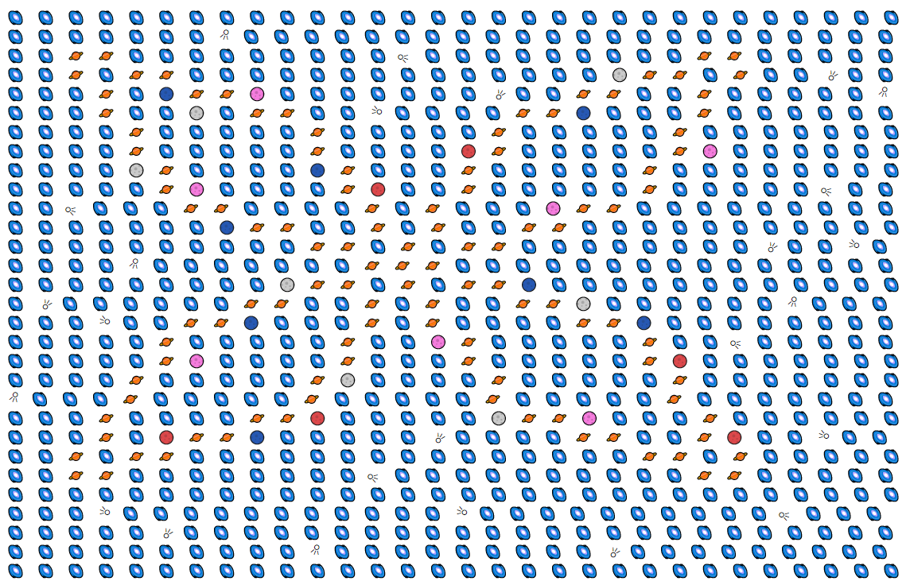

# Emoji-Megaverse 🌕🪐

Needless to say I had a little too much fun with this assignment. It was a simple problem and by just querying
the ``/goal`` API it could've been done in a few lines of code, but that's too easy isn't it.
 
After reading *"no time limit"* and *"we expect the problem to be a little over-engineered"* I got a little carried away.

## Some notes:

Instead of unicode emojis I chose images for the frontend. 
There are multiple reasons for that, one of them is cross-platform compatibility.
The problem can clearly be seen here: (screenshot from crossmint site)



Note that the comETHs aren't displayed properly on my windows machine. Also,
emojis vary across different operating systems, and besides just looking different, 
that also introduces other problems. As example, the comet points in a different direction depending on
which OS it's displayed on. So the ``direction`` property will cease to work correctly.

Also... animations!

One solution would be to set a font family:

``font-family: apple color emoji, segoe ui emoji, noto color emoji, android emoji, emojisymbols, emojione mozilla, twemoji mozilla, segoe ui symbol;``

This will show the comet on windows devices, but emojis will still appear different across systems.

To unify the look across devices I have chosen images. A sprite sheet could surely come in handy when using more emojis, but
wasn't necessary in this case.

Other things which are personal preference: 
 * Named imports > default imports 
 * Absolute paths > relative paths

Unit tests were kept to a minimum to stay in scope of this challenge.

I hope you like it 🌕🪐 Happy building!

## Running the app

First, install the dependencies:

```bash
yarn
```
Then, start the dev server:

```bash
yarn dev
```

The app will be available at port ``3000``

## Using the app

 - The red button resets the editor. Emojis on the left-hand side can be
selected to change the current brush. Some emojis reveal additional options
on hover.

 - Clicking any field inside the editor changes the underlying emoji

 - Clicking the green button uploads the current map to the API (only works if the challenge is active)

After entering the cheat-code additional boxes should appear, clicking
those automatically builds the selected image. 

Phase 1 is done entirely in code while phase 2 is being fetched from the ``/goal`` api.
   
For that reason phase 2 might not work anymore since the the API doesn't respond to our
candidate ID anymore after completing the challenge.


## Konami code

An automated solution for generating the maps is hidden behind a secret code.
Simply enter the Konami-Code on the page and additonal options should appear.

<details>
  <summary>Konami Code Reminder</summary>
  Up, Up, Down, Down, Left, Right, Left, Right, B, A
</details>


## Folder structure

- 
    - [README.md](README.md)
    - __components__ `` - react components``
        - __ArcadeHeader__ `` - header containing arcade font``
            - [index.js](components/ArcadeHeader/index.js)
        - __Emoji__ `` - emoji components``
            - [Cometh.js](components/Emoji/Cometh.js)
            - [Emoji.js](components/Emoji/Emoji.js) `` - base component``
            - [Polyanet.js](components/Emoji/Polyanet.js)
            - [Soloon.js](components/Emoji/Soloon.js)
            - [Space.js](components/Emoji/Space.js)
            - [index.js](components/Emoji/index.js)
        - __EmojiButton__ `` - generic button wrapper for emojis``
            - [index.js](components/EmojiButton/index.js)
        - __EmojiRenderer__ `` - dynamic switching between emojis``
            - [index.js](components/EmojiRenderer/index.js)
        - __MegaverseGrid__ `` - editor grid components``
            - [GridRaster.js](components/MegaverseGrid/GridRaster.js)
            - [GridRasterField.js](components/MegaverseGrid/GridRasterField.js)
            - [index.js](components/MegaverseGrid/index.js)
        - __SecretToolBar__ `` - shhh``
            - [index.js](components/SecretToolBar/index.js)
        - __Toolbar__ `` - contains brushes and reset/ upload button``
            - [index.js](components/Toolbar/index.js)
        - [error\-boundary.js](components/error-boundary.js) `` - error boundary wrapper class``
    - __contexts__ 
        - __MegaverseGridContext__ 
            - [index.js](contexts/MegaverseGridContext/index.js)
        - __SecretCodeContext__
            - [index.js](contexts/SecretCodeContext/index.js)
        - __utils__ 
            - __withContexts__ `` - HOC to provide multiple contexts to the app``
                - [index.js](contexts/utils/withContexts/index.js)
    - __lib__
        - __api__
            - __map__ `` - map related function for the backend ``
                - [index.js](lib/api/map/index.js)
    - __pages__
        - [\_app.js](pages/_app.js)
        - __api__
            - __map__
                - [[phaseId].js](pages/api/map/%5BphaseId%5D.js) `` - used for auto-generation ``
                - __goal__
                    - [index.js](pages/api/map/goal/index.js) `` - current goal GET endpoint``
                - [index.js](pages/api/map/index.js)
        - [index.js](pages/index.js) `` - app index ``
    - __styles__ 
    - __utils__
        - __api__
            - __errors__ `` - withErrors wrapper for backend ``
                - [index.js](utils/api/errors/index.js)
            - __timer__ 
                - [index.js](utils/api/timer/index.js)
        - __debounce__ `` - debounce multiple functions used for anim ``
            - [index.js](utils/debounce/index.js)
        - __emoji__  `` - utils for handling the emoji grid/ emojis``
            - [index.js](utils/emoji/index.js)
        - __error__ `` - error utils``
            - [index.js](utils/error/index.js)
        - __json__ `` - json utils``
            - [index.js](utils/json/index.js)
        - __map__ `` - map utils``
            - [index.js](utils/map/index.js)


